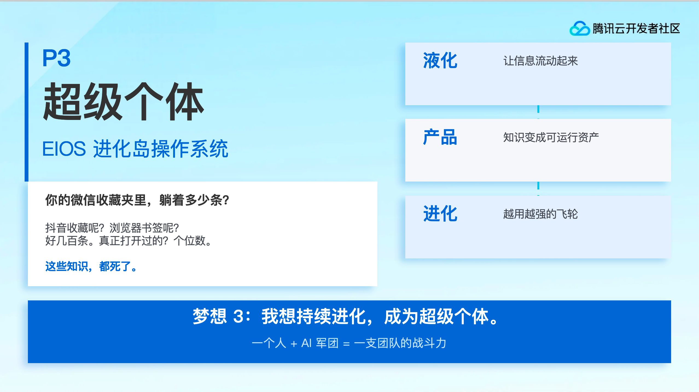

# tencent-cloud-ppt

> 腾讯云风格 PPT 生成技能 — Claude Code Skill

生成统一视觉风格的腾讯云 PPT 演示文稿，适用于公开课、技术分享、产品介绍。



## 特性

- 腾讯云蓝 `#0064CE` 品牌配色体系（13 色）
- PingFang SC / SF Mono 字体规范
- 蓝色阴影系统（`makeShadow` / `makeDeepShadow`）
- 预置组件：章节标签、内容卡片、装饰线、提示卡片
- 统一背景图
- LAYOUT_16x9（10" × 5.625"）标准布局
- LAYOUT_WIDE 自动缩放适配（`wrapSlide` 代理）

## 安装

### Claude Code 用户

```bash
# 方式一：从 GitHub 安装
npx skills add https://github.com/smartchainark/tencent-cloud-ppt

# 方式二：手动安装
git clone https://github.com/smartchainark/tencent-cloud-ppt.git ~/.claude/skills/tencent-cloud-ppt
```

### 非 Claude Code 用户

直接使用 `scripts/design-system.js` 模块：

```bash
git clone https://github.com/smartchainark/tencent-cloud-ppt.git
cp tencent-cloud-ppt/scripts/design-system.js your-project/
cp tencent-cloud-ppt/assets/bg.png your-project/
```

## 依赖

| 依赖 | 类型 | 安装 |
|------|------|------|
| [pptx skill](https://github.com/anthropics/skills) | Claude Code 技能 | `npx skills add https://github.com/anthropics/skills --skill pptx` |
| [pptxgenjs](https://github.com/nicktomlin/pptxgenjs) | Node.js 库 | `npm install pptxgenjs` |
| [markitdown](https://pypi.org/project/markitdown/) | Python 库（可选） | `pip install 'markitdown[pptx]'` |

> **pptx skill** 提供 pptxgenjs API 使用指南和 QA 验证流程。非 Claude Code 用户可参考 [pptxgenjs 官方文档](https://gitbrent.github.io/PptxGenJS/)。

## 快速开始

```javascript
const pptxgen = require("pptxgenjs");
const {
  COLORS, FONTS,
  makeShadow, makeDeepShadow,
  addSectionTag, addCard, addDecoLine, addTipCard
} = require("./design-system");

const BG_IMAGE = __dirname + "/bg.png";

let pres = new pptxgen();
pres.layout = "LAYOUT_16x9";

let slide = pres.addSlide();
slide.background = { path: BG_IMAGE };

addSectionTag(pres, slide, "01", "AI Agent 介绍");
addCard(pres, slide, {
  x: 0.5, y: 1.0, w: 4, h: 3,
  title: "什么是 Agent",
  content: "Agent 是能自主完成任务的 AI 系统..."
});

slide.addNotes("【1 分钟】介绍 Agent 概念");
pres.writeFile({ fileName: "demo.pptx" });
```

## 文件结构

```
tencent-cloud-ppt/
├── SKILL.md                      # Claude Code 技能定义
├── README.md                     # 本文档
├── scripts/
│   └── design-system.js          # 可 require 的设计系统模块
├── references/
│   └── design-system.md          # 完整设计规范文档
└── assets/
    └── bg.png                    # 统一背景图
```

## 导出的组件

| 导出 | 类型 | 说明 |
|------|------|------|
| `COLORS` | Object | 13 色配色方案 |
| `FONTS` | Object | 标题/正文/代码字体 |
| `makeShadow()` | Function | 普通阴影（卡片、图片） |
| `makeDeepShadow()` | Function | 深阴影（重要元素） |
| `addSectionTag(pres, slide, num, title)` | Function | 圆形编号 + 标题 |
| `addCard(pres, slide, opts)` | Function | 圆角内容卡片 |
| `addDecoLine(pres, slide, opts?)` | Function | 左侧装饰线 |
| `addTipCard(pres, slide, opts)` | Function | 浅蓝提示卡片 |

## License

MIT
